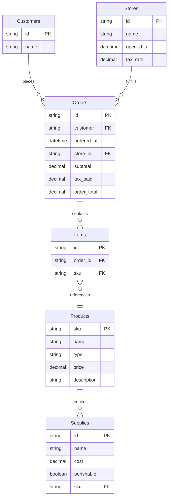

# Jaffle Shop Data Analysis - Final Project

## Data Model

## Instructions
You have been hired as a data analyst for Jaffle Shop, a growing chain of gourmet toasted sandwich restaurants. The executive team needs insights to make strategic business decisions.

Using the provided datasets and Python Polars, analyze the business performance and provide data-driven recommendations. You must use Polars for all data manipulation and analysis.

## Available Data
- `Customers.csv`: Customer information
- `Orders.csv`: Order transactions with totals and timestamps
- `Items.csv`: Individual items within each order
- `Products.csv`: Product catalog with prices and descriptions
- `Stores.csv`: Store locations and opening dates
- `Supplies.csv`: Supply costs for each product

## Business Questions
Found in the .ipynb file.

## Deliverables
1. A Jupyter notebook with your complete analysis
2. Clear visualizations supporting your findings
3. Executive summary with key insights (maximum 1 page)

## Grading Rubric

**Total Points: 100%**

### Technical Analysis & Code Correctness (50%)
- **Polars Implementation**: Correct use of Polars for all data manipulation and analysis tasks
  - Each question's analysis must produce the specified variable names
  - Code must execute without errors
  - Proper data transformations and aggregations
  - Efficient use of Polars methods and syntax

### Autograder Penalty (-15%)
- **Notebook Execution (Penalty)**: If `final_project.ipynb` fails to run correctly in the GitHub autograder after the deadline, 15 points will be deducted from the final grade due to manual grading requirements

### Data Visualizations (25%)
- **Chart Quality and Relevance**: Effective visualizations that support business insights
  - Clear, well-labeled charts and graphs
  - Appropriate chart types for the data being presented
  - Visualizations that enhance understanding of key findings
  - Professional presentation quality

### Executive Summary (25%)
- **Business Insights and Recommendations**: Comprehensive summary and strategic recommendations
  - Clear identification of key business findings
  - Three specific, data-driven recommendations
  - Supporting evidence from the analysis
  - Professional writing and business relevance
  - Maximum 1 page when printed

### Additional Requirements
- All analysis must use Python Polars (no pandas or other data manipulation libraries)
- Code must be well-organized and documented
- Variable names must match specifications for autograder compatibility